# Steam Overachiever v3 — Data Architecture

This document describes where data lives, where it comes from, and how it flows through the system. It's written for someone new to the codebase.

---

## Table of Contents

1. [System Overview](#system-overview)
2. [External Data Sources](#external-data-sources)
3. [Local Database (SQLite)](#local-database-sqlite)
4. [Backend Database (PostgreSQL)](#backend-database-postgresql)
5. [Local vs Backend Data Comparison](#local-vs-backend-data-comparison)
6. [Configuration & Settings](#configuration--settings)
7. [Application Startup Flow](#application-startup-flow)
8. [Steam Update Flow](#steam-update-flow)
9. [Cloud Sync Flow](#cloud-sync-flow)
10. [Authentication Flow](#authentication-flow)
11. [TTB (Time to Beat) Flow](#ttb-time-to-beat-flow)
12. [Tags Scanning Flow](#tags-scanning-flow)
13. [Achievement Rating Flow](#achievement-rating-flow)
14. [In-Memory Caching](#in-memory-caching)
15. [Background Operations & Progress](#background-operations--progress)

---

## System Overview

Steam Overachiever is a desktop app (built with egui/eframe) that tracks your Steam achievement progress, game library, and completion times. It has a local-first architecture — the desktop app works fully offline with a local SQLite database, and optionally syncs to a backend server.

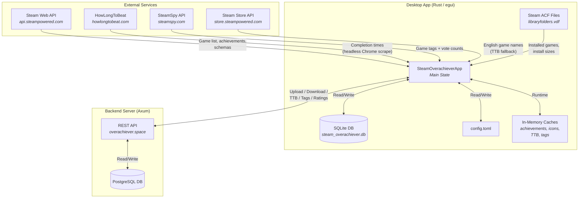
```mermaid
graph TB
    subgraph External["External Services"]
        STEAM["Steam Web API<br/><i>api.steampowered.com</i>"]
        HLTB["HowLongToBeat<br/><i>howlongtobeat.com</i>"]
        SSPY["SteamSpy API<br/><i>steamspy.com</i>"]
        STORE["Steam Store API<br/><i>store.steampowered.com</i>"]
    end

    subgraph Desktop["Desktop App (Rust / egui)"]
        APP["SteamOverachieverApp<br/><i>Main State</i>"]
        SQLITE[("SQLite DB<br/><i>steam_overachiever.db</i>")]
        CONFIG["config.toml"]
        MEMCACHE["In-Memory Caches<br/><i>achievements, icons,<br/>TTB, tags</i>"]
        ACF["Steam ACF Files<br/><i>libraryfolders.vdf</i>"]
    end

    subgraph Backend["Backend Server (Axum)"]
        API["REST API<br/><i>overachiever.space</i>"]
        PG[("PostgreSQL DB")]
    end

    STEAM -->|"Game list, achievements,<br/>schemas"| APP
    HLTB -->|"Completion times<br/>(headless Chrome scrape)"| APP
    SSPY -->|"Game tags + vote counts"| APP
    STORE -->|"English game names<br/>(TTB fallback)"| APP
    ACF -->|"Installed games,<br/>install sizes"| APP

    APP <-->|"Read/Write"| SQLITE
    APP <-->|"Read/Write"| CONFIG
    APP <-->|"Runtime"| MEMCACHE
    APP <-->|"Upload / Download /<br/>TTB / Tags / Ratings"| API
    API <-->|"Read/Write"| PG
```

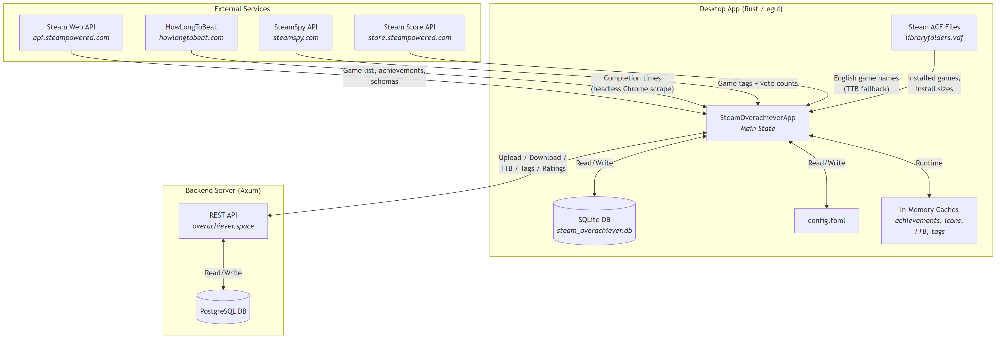

---

## External Data Sources

The app pulls data from five external sources. Here's what each provides and when it's called.

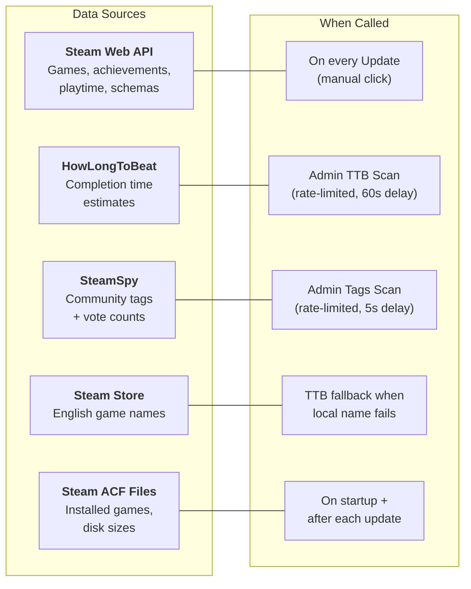
```mermaid
graph LR
    subgraph Sources["Data Sources"]
        direction TB
        S1["<b>Steam Web API</b><br/>Games, achievements,<br/>playtime, schemas"]
        S2["<b>HowLongToBeat</b><br/>Completion time<br/>estimates"]
        S3["<b>SteamSpy</b><br/>Community tags<br/>+ vote counts"]
        S4["<b>Steam Store</b><br/>English game names"]
        S5["<b>Steam ACF Files</b><br/>Installed games,<br/>disk sizes"]
    end

    subgraph When["When Called"]
        direction TB
        W1["On every Update<br/>(manual click)"]
        W2["Admin TTB Scan<br/>(rate-limited, 60s delay)"]
        W3["Admin Tags Scan<br/>(rate-limited, 5s delay)"]
        W4["TTB fallback when<br/>local name fails"]
        W5["On startup +<br/>after each update"]
    end

    S1 --- W1
    S2 --- W2
    S3 --- W3
    S4 --- W4
    S5 --- W5
```

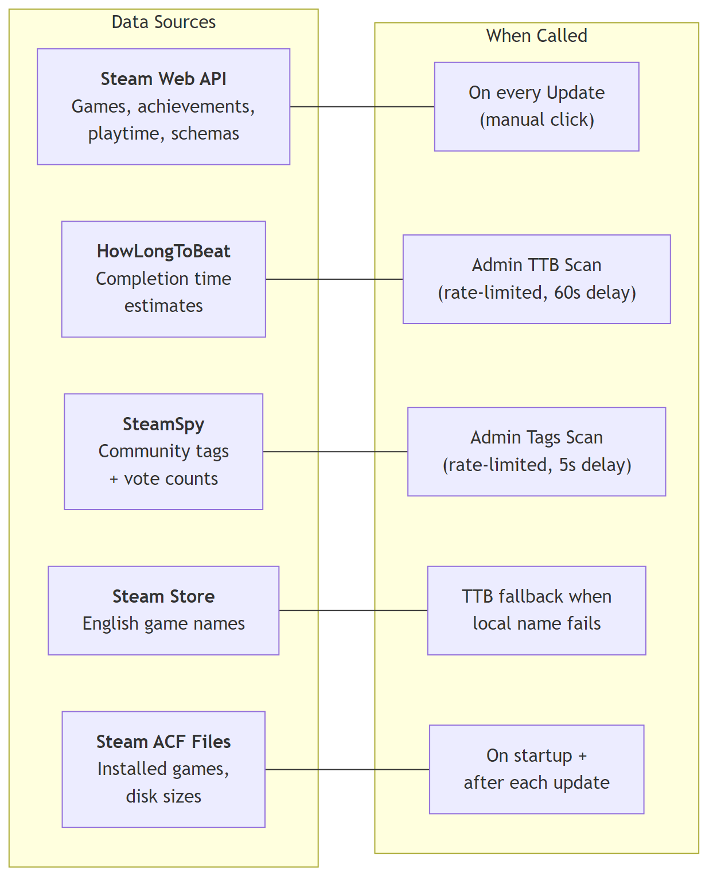

### Steam Web API

| Endpoint | Data Returned | When Called |
|----------|--------------|-------------|
| `IPlayerService/GetOwnedGames/v1` | All owned games with playtime, icons | Every update |
| `IPlayerService/GetRecentlyPlayedGames/v1` | Recently played (catches F2P games) | Every update |
| `ISteamUserStats/GetPlayerAchievements/v0001` | Per-game achievement unlock status | Achievement scrape |
| `ISteamUserStats/GetSchemaForGame/v2` | Achievement names, descriptions, icons | Achievement scrape |

- **Auth:** Steam Web API key (user provides, stored in `config.toml`)
- **Rate limit:** 100ms delay between achievement API calls
- **Timeout:** 30 seconds per request

### HowLongToBeat

- **Method:** Headless Chrome (stealth mode) scrapes search results
- **Data:** Main / Main+Extra / Completionist completion hours
- **Rate limit:** Configurable delay between fetches (default: 60 seconds)
- **Cache:** Results cached locally in `ttb_cache` table and uploaded to backend

### SteamSpy

- **Endpoint:** `steamspy.com/api.php?request=appdetails&appid={id}`
- **Data:** Tag names with community vote counts
- **Rate limit:** Configurable delay (default: 5 seconds)
- **Cache:** Stored on backend, served to all users via batch API

### Steam Store API

- **Endpoint:** `store.steampowered.com/api/appdetails?appids={id}&l=english`
- **Purpose:** Fetch English game name when local name fails HLTB search
- **When:** Only during TTB scanning as a fallback

### Steam ACF Files (Local Filesystem)

- **Source:** `libraryfolders.vdf` and `appmanifest_*.acf` files in Steam install directories
- **Data:** Which games are installed, install sizes on disk
- **When:** On startup and after each update

---

## Local Database (SQLite)

**Location:** Platform data directory / `steam_overachiever.db`
- Windows: `%APPDATA%\Overachiever\steam_overachiever.db`
- Linux: `~/.local/share/Overachiever/steam_overachiever.db`
- macOS: `~/Library/Application Support/Overachiever/steam_overachiever.db`

**Engine:** SQLite via `rusqlite` (bundled)

### Entity Relationship Diagram

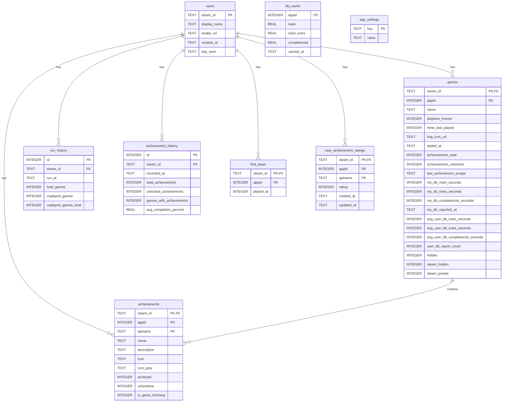
```mermaid
erDiagram
    users {
        TEXT steam_id PK
        TEXT display_name
        TEXT avatar_url
        TEXT created_at
        TEXT last_seen
    }

    games {
        TEXT steam_id PK, FK
        INTEGER appid PK
        TEXT name
        INTEGER playtime_forever
        INTEGER rtime_last_played
        TEXT img_icon_url
        TEXT added_at
        INTEGER achievements_total
        INTEGER achievements_unlocked
        TEXT last_achievement_scrape
        INTEGER my_ttb_main_seconds
        INTEGER my_ttb_extra_seconds
        INTEGER my_ttb_completionist_seconds
        TEXT my_ttb_reported_at
        INTEGER avg_user_ttb_main_seconds
        INTEGER avg_user_ttb_extra_seconds
        INTEGER avg_user_ttb_completionist_seconds
        INTEGER user_ttb_report_count
        INTEGER hidden
        INTEGER steam_hidden
        INTEGER steam_private
    }

    achievements {
        TEXT steam_id PK, FK
        INTEGER appid PK
        TEXT apiname PK
        TEXT name
        TEXT description
        TEXT icon
        TEXT icon_gray
        INTEGER achieved
        INTEGER unlocktime
        INTEGER is_game_finishing
    }

    run_history {
        INTEGER id PK
        TEXT steam_id FK
        TEXT run_at
        INTEGER total_games
        INTEGER unplayed_games
        INTEGER unplayed_games_total
    }

    achievement_history {
        INTEGER id PK
        TEXT steam_id FK
        TEXT recorded_at
        INTEGER total_achievements
        INTEGER unlocked_achievements
        INTEGER games_with_achievements
        REAL avg_completion_percent
    }

    first_plays {
        TEXT steam_id PK, FK
        INTEGER appid PK
        INTEGER played_at
    }

    user_achievement_ratings {
        TEXT steam_id PK, FK
        INTEGER appid PK
        TEXT apiname PK
        INTEGER rating
        TEXT created_at
        TEXT updated_at
    }

    ttb_cache {
        INTEGER appid PK
        REAL main
        REAL main_extra
        REAL completionist
        TEXT cached_at
    }

    app_settings {
        TEXT key PK
        TEXT value
    }

    users ||--o{ games : "has"
    users ||--o{ achievements : "has"
    users ||--o{ run_history : "has"
    users ||--o{ achievement_history : "has"
    users ||--o{ first_plays : "has"
    users ||--o{ user_achievement_ratings : "has"
    games ||--o{ achievements : "contains"
```

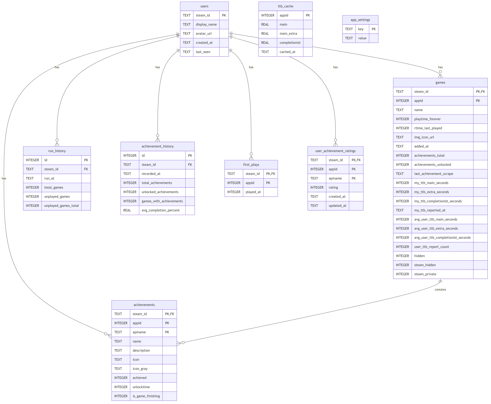

### Table Descriptions

| Table | Rows Per User | Purpose |
|-------|--------------|---------|
| `users` | 1 | Steam profile metadata; supports multi-user |
| `games` | ~hundreds-thousands | Full game library with playtime, achievement counts, TTB, visibility flags |
| `achievements` | ~tens of thousands | Every achievement definition + unlock status + timestamps |
| `run_history` | 1 per update | Snapshot of total/unplayed game counts over time (for trend graphs) |
| `achievement_history` | 1 per update | Snapshot of achievement stats over time (for trend graphs) |
| `first_plays` | 1 per game | When user first played each game |
| `user_achievement_ratings` | 0-many | User's 1-5 star ratings on individual achievements |
| `ttb_cache` | 1 per game (global) | HowLongToBeat completion times; shared across all users |
| `app_settings` | ~3 keys | Key-value flags: `last_update`, `initial_scan_complete`, `synced_private_games` |

### Key Design Decisions

- **Multi-user:** All per-user tables include `steam_id` in the primary key
- **Booleans as integers:** SQLite stores booleans as 0/1
- **Timestamps:** RFC3339 text for dates, Unix integers for achievement unlock times
- **UPSERT:** Uses `INSERT ... ON CONFLICT` for safe updates
- **TTB cache is global:** Not per-user — same game completion times apply to all users

---

## Backend Database (PostgreSQL)

**Server:** `overachiever.space` (Axum web framework)
**Database:** PostgreSQL with `deadpool-postgres` connection pooling

### Entity Relationship Diagram

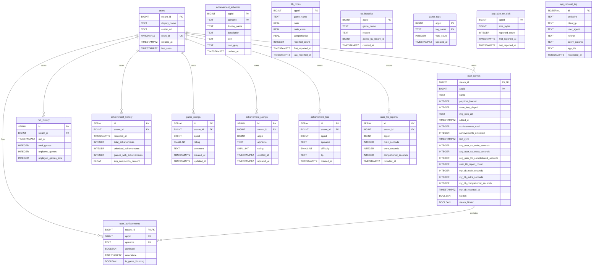
```mermaid
erDiagram
    users {
        BIGINT steam_id PK
        TEXT display_name
        TEXT avatar_url
        VARCHAR12 short_id UK
        TIMESTAMPTZ created_at
        TIMESTAMPTZ last_seen
    }

    user_games {
        BIGINT steam_id PK, FK
        BIGINT appid PK
        TEXT name
        INTEGER playtime_forever
        INTEGER rtime_last_played
        TEXT img_icon_url
        TIMESTAMPTZ added_at
        INTEGER achievements_total
        INTEGER achievements_unlocked
        TIMESTAMPTZ last_sync
        INTEGER avg_user_ttb_main_seconds
        INTEGER avg_user_ttb_extra_seconds
        INTEGER avg_user_ttb_completionist_seconds
        INTEGER user_ttb_report_count
        INTEGER my_ttb_main_seconds
        INTEGER my_ttb_extra_seconds
        INTEGER my_ttb_completionist_seconds
        TIMESTAMPTZ my_ttb_reported_at
        BOOLEAN hidden
        BOOLEAN steam_hidden
    }

    user_achievements {
        BIGINT steam_id PK, FK
        BIGINT appid PK
        TEXT apiname PK
        BOOLEAN achieved
        TIMESTAMPTZ unlocktime
        BOOLEAN is_game_finishing
    }

    achievement_schemas {
        BIGINT appid PK
        TEXT apiname PK
        TEXT display_name
        TEXT description
        TEXT icon
        TEXT icon_gray
        TIMESTAMPTZ cached_at
    }

    run_history {
        SERIAL id PK
        BIGINT steam_id FK
        TIMESTAMPTZ run_at
        INTEGER total_games
        INTEGER unplayed_games
        INTEGER unplayed_games_total
    }

    achievement_history {
        SERIAL id PK
        BIGINT steam_id FK
        TIMESTAMPTZ recorded_at
        INTEGER total_achievements
        INTEGER unlocked_achievements
        INTEGER games_with_achievements
        FLOAT avg_completion_percent
    }

    game_ratings {
        SERIAL id PK
        BIGINT steam_id FK
        BIGINT appid
        SMALLINT rating
        TEXT comment
        TIMESTAMPTZ created_at
        TIMESTAMPTZ updated_at
    }

    achievement_ratings {
        SERIAL id PK
        BIGINT steam_id FK
        BIGINT appid
        TEXT apiname
        SMALLINT rating
        TIMESTAMPTZ created_at
        TIMESTAMPTZ updated_at
    }

    achievement_tips {
        SERIAL id PK
        BIGINT steam_id FK
        BIGINT appid
        TEXT apiname
        SMALLINT difficulty
        TEXT tip
        TIMESTAMPTZ created_at
    }

    user_ttb_reports {
        SERIAL id PK
        BIGINT steam_id FK
        BIGINT appid
        INTEGER main_seconds
        INTEGER extra_seconds
        INTEGER completionist_seconds
        TIMESTAMPTZ reported_at
    }

    ttb_times {
        BIGINT appid PK
        TEXT game_name
        REAL main
        REAL main_extra
        REAL completionist
        INTEGER reported_count
        TIMESTAMPTZ first_reported_at
        TIMESTAMPTZ last_reported_at
    }

    ttb_blacklist {
        BIGINT appid PK
        TEXT game_name
        TEXT reason
        BIGINT added_by_steam_id
        TIMESTAMPTZ created_at
    }

    game_tags {
        BIGINT appid PK
        TEXT tag_name PK
        INTEGER vote_count
        TIMESTAMPTZ updated_at
    }

    app_size_on_disk {
        BIGINT appid PK
        BIGINT size_bytes
        INTEGER reported_count
        TIMESTAMPTZ first_reported_at
        TIMESTAMPTZ last_reported_at
    }

    api_request_log {
        BIGSERIAL id PK
        TEXT endpoint
        TEXT client_ip
        TEXT user_agent
        TEXT referer
        TEXT query_params
        TEXT app_ids
        TIMESTAMPTZ requested_at
    }

    users ||--o{ user_games : "owns"
    users ||--o{ user_achievements : "has"
    users ||--o{ run_history : "tracks"
    users ||--o{ achievement_history : "tracks"
    users ||--o{ game_ratings : "rates"
    users ||--o{ achievement_ratings : "rates"
    users ||--o{ achievement_tips : "writes"
    users ||--o{ user_ttb_reports : "reports"
    user_games ||--o{ user_achievements : "contains"
```

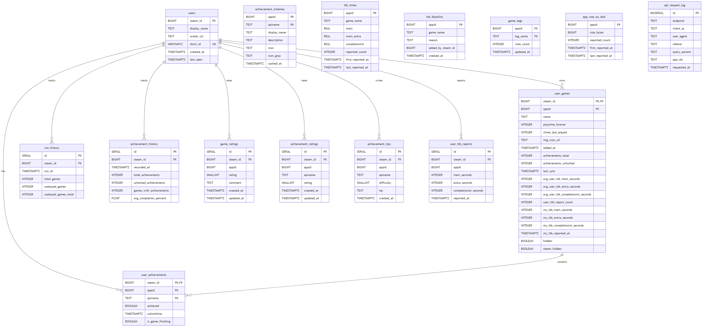

### Table Categories

#### Per-User Data (requires authentication)

| Table | Purpose |
|-------|---------|
| `users` | Steam profiles with YouTube-style short IDs for shareable URLs |
| `user_games` | Full game library mirror (from cloud sync uploads) |
| `user_achievements` | Achievement unlock status (lightweight — no icons/descriptions) |
| `run_history` | Historical game count snapshots |
| `achievement_history` | Historical achievement progress snapshots |
| `game_ratings` | User's 1-5 star game ratings + comments |
| `achievement_ratings` | User's 1-5 star achievement ratings |
| `achievement_tips` | User-written tips/guides for achievements |
| `user_ttb_reports` | User-reported completion times |

#### Community Data (shared across all users)

| Table | Purpose |
|-------|---------|
| `ttb_times` | Aggregated HowLongToBeat data (scraped by desktop clients) |
| `ttb_blacklist` | Games excluded from TTB scanning (admin-managed) |
| `game_tags` | SteamSpy tags with vote counts |
| `app_size_on_disk` | Community-reported game install sizes |
| `achievement_schemas` | Cached achievement definitions from Steam |

#### System Tables

| Table | Purpose |
|-------|---------|
| `sync_history` | Tracks when users synced |
| `api_request_log` | Public API usage analytics |

### PostgreSQL-Specific Features

- **Foreign key cascades:** `ON DELETE CASCADE` from `users` to all per-user tables
- **Trigger functions:** `update_ttb_averages()` automatically recalculates community TTB averages when reports are submitted
- **Check constraints:** Ratings constrained to 1-5 range
- **TIMESTAMPTZ:** All timestamps timezone-aware

---

## Local vs Backend Data Comparison

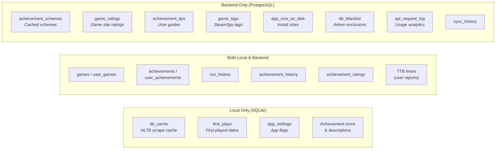
```mermaid
graph LR
    subgraph local["Local Only (SQLite)"]
        L1["ttb_cache<br/><i>HLTB scrape cache</i>"]
        L2["first_plays<br/><i>First played dates</i>"]
        L3["app_settings<br/><i>App flags</i>"]
        L4["Achievement icons<br/>& descriptions"]
    end

    subgraph both["Both Local & Backend"]
        B1["games / user_games"]
        B2["achievements /<br/>user_achievements"]
        B3["run_history"]
        B4["achievement_history"]
        B5["achievement_ratings"]
        B6["TTB times<br/><i>(user reports)</i>"]
    end

    subgraph remote["Backend Only (PostgreSQL)"]
        R1["achievement_schemas<br/><i>Cached schemas</i>"]
        R2["game_ratings<br/><i>Game star ratings</i>"]
        R3["achievement_tips<br/><i>User guides</i>"]
        R4["game_tags<br/><i>SteamSpy tags</i>"]
        R5["app_size_on_disk<br/><i>Install sizes</i>"]
        R6["ttb_blacklist<br/><i>Admin exclusions</i>"]
        R7["api_request_log<br/><i>Usage analytics</i>"]
        R8["sync_history"]
    end
```

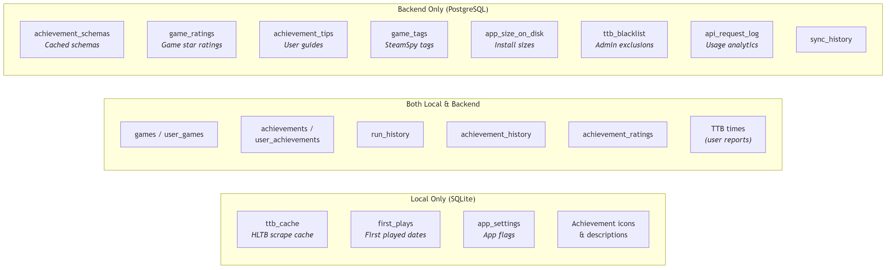

### Key Differences

| Aspect | Local (SQLite) | Backend (PostgreSQL) |
|--------|---------------|---------------------|
| Achievement data | Full: icons, descriptions, gray icons | Lightweight: just apiname, achieved, unlocktime |
| TTB data | `ttb_cache`: simple hours cache | `ttb_times` + `user_ttb_reports`: full reporting system with aggregation triggers |
| Game visibility | `hidden`, `steam_hidden`, `steam_private` flags | `hidden`, `steam_hidden` (no `steam_private`) |
| First plays | Tracked locally | Not synced to backend |
| Tags | In-memory cache only (fetched from backend) | Persistent `game_tags` table |
| Install sizes | Read from ACF files at runtime | Community-aggregated `app_size_on_disk` table |
| Timestamps | Mix of RFC3339 text and Unix integers | All `TIMESTAMPTZ` |

---

## Configuration & Settings

### config.toml

**Location:** Platform config directory / `config.toml`
- Windows: `%APPDATA%\Overachiever\config.toml`

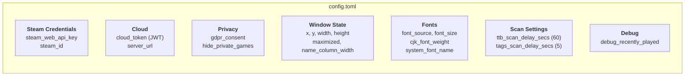
```mermaid
graph TD
    subgraph Config["config.toml"]
        direction TB
        CREDS["<b>Steam Credentials</b><br/>steam_web_api_key<br/>steam_id"]
        CLOUD["<b>Cloud</b><br/>cloud_token (JWT)<br/>server_url"]
        GDPR["<b>Privacy</b><br/>gdpr_consent<br/>hide_private_games"]
        WINDOW["<b>Window State</b><br/>x, y, width, height<br/>maximized, name_column_width"]
        FONT["<b>Fonts</b><br/>font_source, font_size<br/>cjk_font_weight<br/>system_font_name"]
        SCAN["<b>Scan Settings</b><br/>ttb_scan_delay_secs (60)<br/>tags_scan_delay_secs (5)"]
        DEBUG["<b>Debug</b><br/>debug_recently_played"]
    end
```

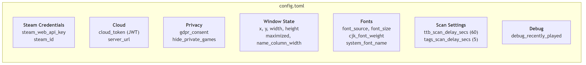

### app_settings Table (SQLite Key-Value Store)

| Key | Purpose |
|-----|---------|
| `last_update` | RFC3339 timestamp of last Steam API update |
| `initial_scan_complete` | Whether baseline achievement scan has finished |
| `synced_private_games` | Whether private games have been imported from Steam config |

---

## Application Startup Flow

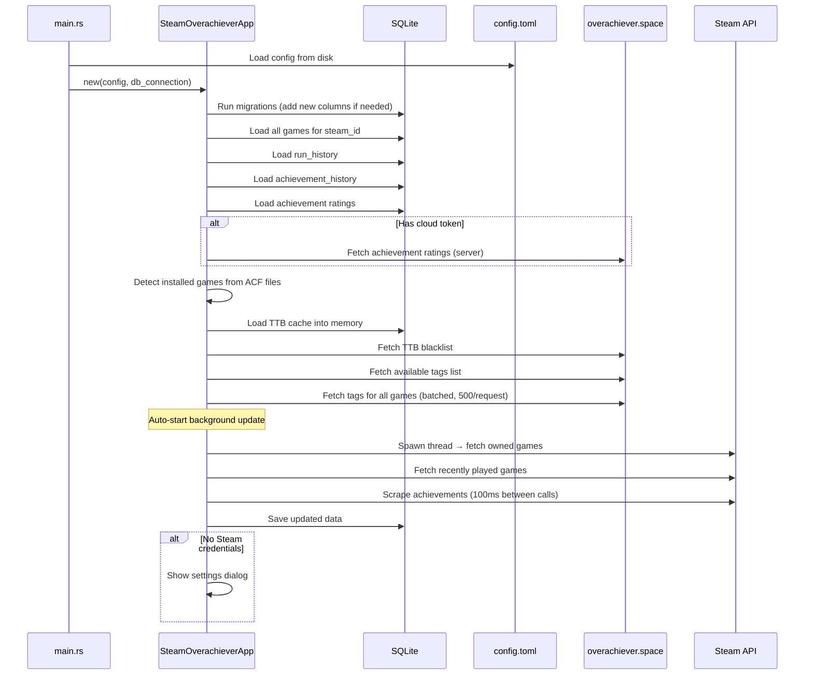
```mermaid
sequenceDiagram
    participant Main as main.rs
    participant App as SteamOverachieverApp
    participant DB as SQLite
    participant Config as config.toml
    participant Backend as overachiever.space
    participant Steam as Steam API

    Main->>Config: Load config from disk
    Main->>App: new(config, db_connection)

    App->>DB: Run migrations (add new columns if needed)
    App->>DB: Load all games for steam_id
    App->>DB: Load run_history
    App->>DB: Load achievement_history
    App->>DB: Load achievement ratings

    alt Has cloud token
        App->>Backend: Fetch achievement ratings (server)
    end

    App->>App: Detect installed games from ACF files
    App->>DB: Load TTB cache into memory
    App->>Backend: Fetch TTB blacklist
    App->>Backend: Fetch available tags list
    App->>Backend: Fetch tags for all games (batched, 500/request)

    Note over App: Auto-start background update
    App->>Steam: Spawn thread → fetch owned games
    App->>Steam: Fetch recently played games
    App->>Steam: Scrape achievements (100ms between calls)
    App->>DB: Save updated data

    alt No Steam credentials
        App->>App: Show settings dialog
    end
```

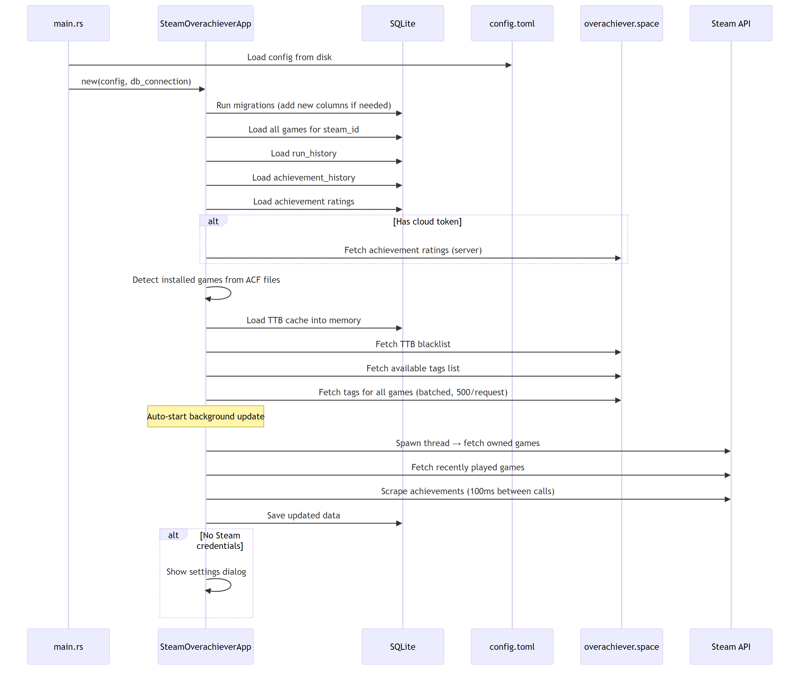

---

## Steam Update Flow

This is the main data refresh cycle, triggered by clicking "Update" or automatically on startup.

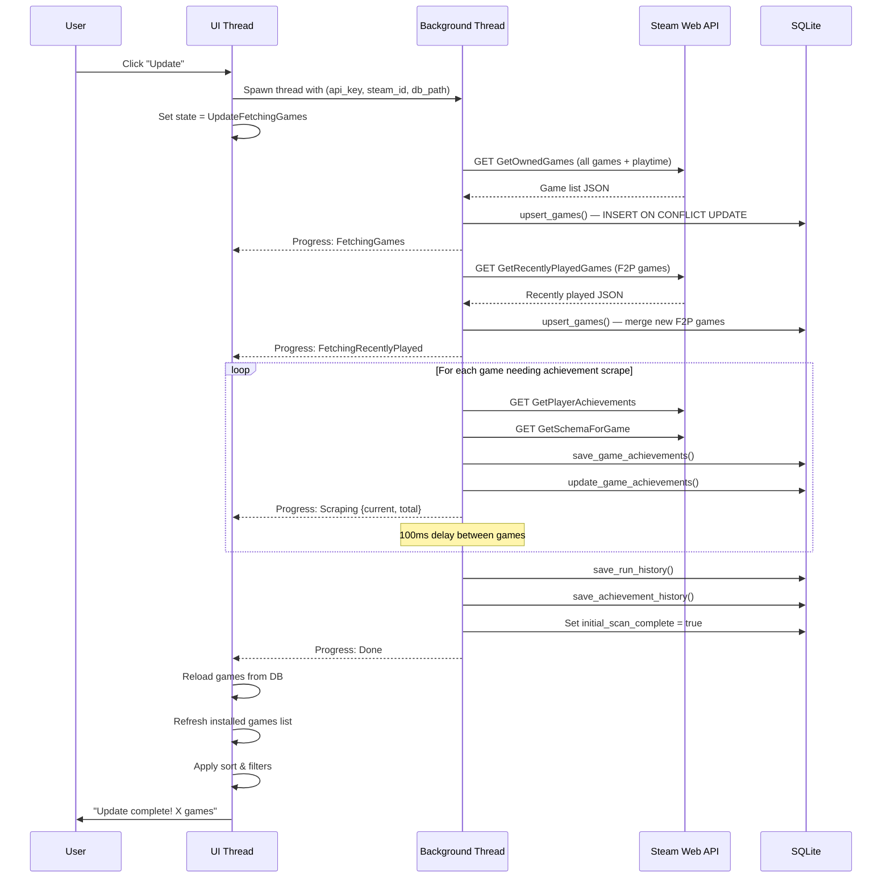
```mermaid
sequenceDiagram
    participant User
    participant UI as UI Thread
    participant BG as Background Thread
    participant Steam as Steam Web API
    participant DB as SQLite

    User->>UI: Click "Update"
    UI->>BG: Spawn thread with (api_key, steam_id, db_path)
    UI->>UI: Set state = UpdateFetchingGames

    BG->>Steam: GET GetOwnedGames (all games + playtime)
    Steam-->>BG: Game list JSON
    BG->>DB: upsert_games() — INSERT ON CONFLICT UPDATE
    BG-->>UI: Progress: FetchingGames

    BG->>Steam: GET GetRecentlyPlayedGames (F2P games)
    Steam-->>BG: Recently played JSON
    BG->>DB: upsert_games() — merge new F2P games
    BG-->>UI: Progress: FetchingRecentlyPlayed

    loop For each game needing achievement scrape
        BG->>Steam: GET GetPlayerAchievements
        BG->>Steam: GET GetSchemaForGame
        BG->>DB: save_game_achievements()
        BG->>DB: update_game_achievements()
        BG-->>UI: Progress: Scraping {current, total}
        Note over BG: 100ms delay between games
    end

    BG->>DB: save_run_history()
    BG->>DB: save_achievement_history()
    BG->>DB: Set initial_scan_complete = true
    BG-->>UI: Progress: Done

    UI->>UI: Reload games from DB
    UI->>UI: Refresh installed games list
    UI->>UI: Apply sort & filters
    UI->>User: "Update complete! X games"
```

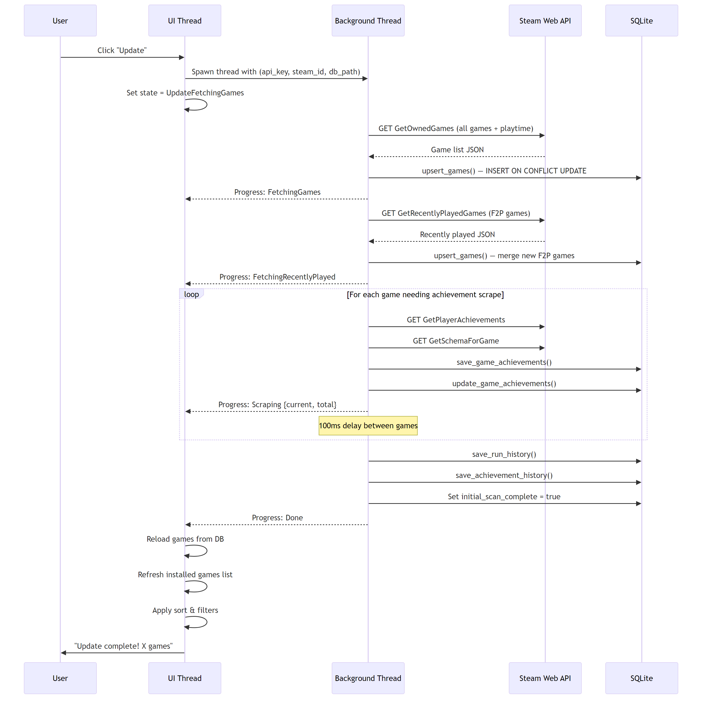

### What Gets Scraped

- **First run:** All games with achievements
- **Subsequent runs:** Only games played since last scrape (based on `last_achievement_scrape`)
- **Force full scan:** User can trigger a full re-scrape of all games

---

## Cloud Sync Flow

Cloud sync is **manual only** — no automatic background sync. The user explicitly clicks Upload, Download, or Delete.

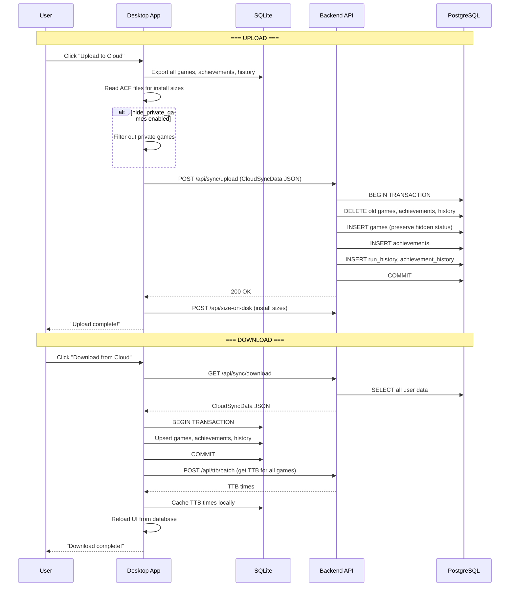
```mermaid
sequenceDiagram
    participant User
    participant App as Desktop App
    participant DB as SQLite
    participant API as Backend API
    participant PG as PostgreSQL

    Note over User,PG: === UPLOAD ===
    User->>App: Click "Upload to Cloud"
    App->>DB: Export all games, achievements, history
    App->>App: Read ACF files for install sizes

    alt hide_private_games enabled
        App->>App: Filter out private games
    end

    App->>API: POST /api/sync/upload (CloudSyncData JSON)
    API->>PG: BEGIN TRANSACTION
    API->>PG: DELETE old games, achievements, history
    API->>PG: INSERT games (preserve hidden status)
    API->>PG: INSERT achievements
    API->>PG: INSERT run_history, achievement_history
    API->>PG: COMMIT
    API-->>App: 200 OK

    App->>API: POST /api/size-on-disk (install sizes)
    App-->>User: "Upload complete!"

    Note over User,PG: === DOWNLOAD ===
    User->>App: Click "Download from Cloud"
    App->>API: GET /api/sync/download
    API->>PG: SELECT all user data
    API-->>App: CloudSyncData JSON

    App->>DB: BEGIN TRANSACTION
    App->>DB: Upsert games, achievements, history
    App->>DB: COMMIT
    App->>API: POST /api/ttb/batch (get TTB for all games)
    API-->>App: TTB times
    App->>DB: Cache TTB times locally
    App->>App: Reload UI from database
    App-->>User: "Download complete!"
```

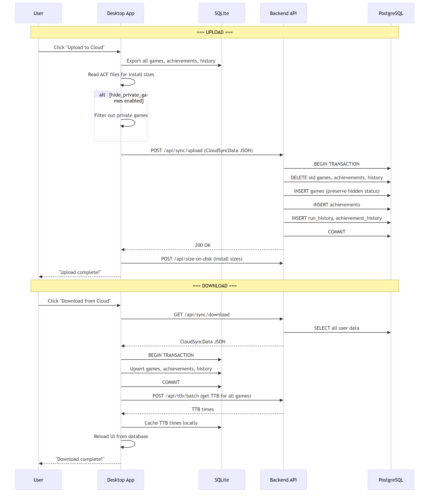

### CloudSyncData Structure

```
CloudSyncData {
    steam_id: String,
    games: Vec<Game>,                          // Full game objects
    achievements: Vec<SyncAchievement>,        // Lightweight (no icons)
    run_history: Vec<RunHistory>,
    achievement_history: Vec<AchievementHistory>,
    exported_at: DateTime<Utc>,
}
```

---

## Authentication Flow

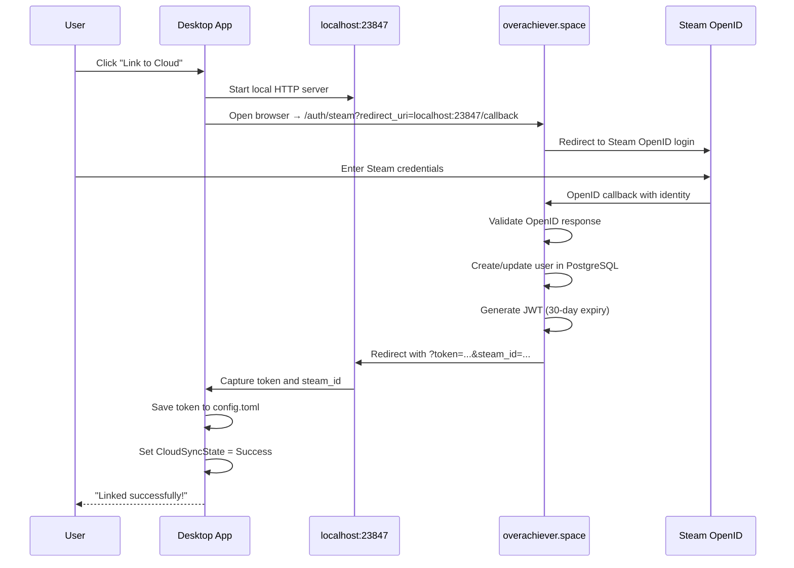
```mermaid
sequenceDiagram
    participant User
    participant App as Desktop App
    participant Localhost as localhost:23847
    participant Backend as overachiever.space
    participant Steam as Steam OpenID

    User->>App: Click "Link to Cloud"
    App->>Localhost: Start local HTTP server
    App->>Backend: Open browser → /auth/steam?redirect_uri=localhost:23847/callback

    Backend->>Steam: Redirect to Steam OpenID login
    User->>Steam: Enter Steam credentials
    Steam->>Backend: OpenID callback with identity

    Backend->>Backend: Validate OpenID response
    Backend->>Backend: Create/update user in PostgreSQL
    Backend->>Backend: Generate JWT (30-day expiry)
    Backend->>Localhost: Redirect with ?token=...&steam_id=...

    Localhost->>App: Capture token and steam_id
    App->>App: Save token to config.toml
    App->>App: Set CloudSyncState = Success
    App-->>User: "Linked successfully!"
```

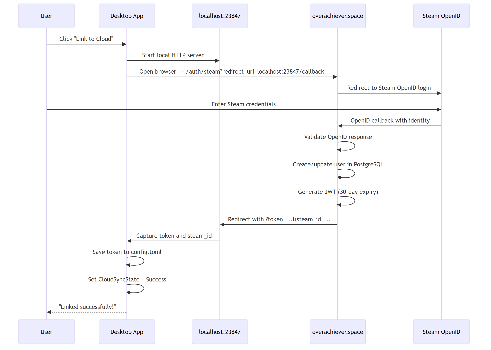

### JWT Claims

```
{
    steam_id: "76561198...",
    display_name: "PlayerName",
    avatar_url: "https://...",
    short_id: "abc123",        // YouTube-style shareable ID
    exp: 1234567890             // 30-day expiry (7 days for web)
}
```

---

## TTB (Time to Beat) Flow

TTB data flows through a multi-stage pipeline involving web scraping, local caching, and backend aggregation.

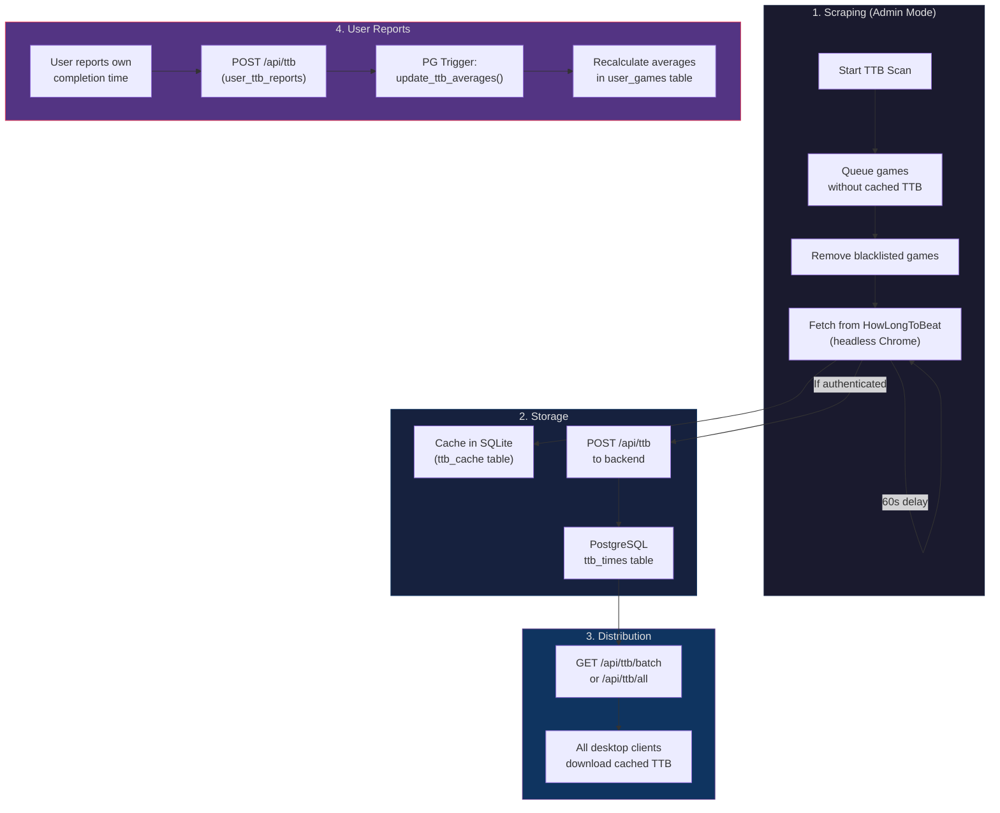
```mermaid
flowchart TB
    subgraph Scraping["1. Scraping (Admin Mode)"]
        START["Start TTB Scan"] --> QUEUE["Queue games<br/>without cached TTB"]
        QUEUE --> FILTER["Remove blacklisted games"]
        FILTER --> FETCH["Fetch from HowLongToBeat<br/>(headless Chrome)"]
        FETCH -->|"60s delay"| FETCH
    end

    subgraph Storage["2. Storage"]
        FETCH --> LOCAL["Cache in SQLite<br/>(ttb_cache table)"]
        FETCH -->|"If authenticated"| UPLOAD["POST /api/ttb<br/>to backend"]
        UPLOAD --> PGTTB["PostgreSQL<br/>ttb_times table"]
    end

    subgraph Distribution["3. Distribution"]
        PGTTB --> BATCH["GET /api/ttb/batch<br/>or /api/ttb/all"]
        BATCH --> CLIENTS["All desktop clients<br/>download cached TTB"]
    end

    subgraph UserReports["4. User Reports"]
        REPORT["User reports own<br/>completion time"] --> UPOST["POST /api/ttb<br/>(user_ttb_reports)"]
        UPOST --> TRIGGER["PG Trigger:<br/>update_ttb_averages()"]
        TRIGGER --> AVG["Recalculate averages<br/>in user_games table"]
    end

    style Scraping fill:#1a1a2e,stroke:#16213e,color:#e0e0e0
    style Storage fill:#16213e,stroke:#0f3460,color:#e0e0e0
    style Distribution fill:#0f3460,stroke:#533483,color:#e0e0e0
    style UserReports fill:#533483,stroke:#e94560,color:#e0e0e0
```


### TTB Data Sources (Priority Order)

1. **User's own report** (`my_ttb_*` fields) — shown if user has reported their time
2. **Community average** (`avg_user_ttb_*` fields) — calculated from all user reports via PG trigger
3. **HowLongToBeat scraped data** (`ttb_cache` / `ttb_times`) — fallback from web scrape

### TTB Blacklist

Admin-managed list of games that shouldn't be scanned (multiplayer-only, no clear completion criteria, etc.). Fetched on startup from `GET /api/ttb/blacklist`.

---

## Tags Scanning Flow

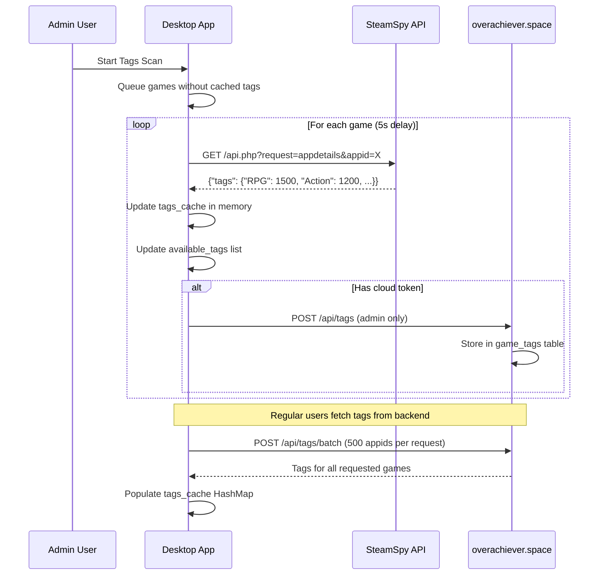
```mermaid
sequenceDiagram
    participant Admin as Admin User
    participant App as Desktop App
    participant SteamSpy as SteamSpy API
    participant Backend as overachiever.space

    Admin->>App: Start Tags Scan
    App->>App: Queue games without cached tags

    loop For each game (5s delay)
        App->>SteamSpy: GET /api.php?request=appdetails&appid=X
        SteamSpy-->>App: {"tags": {"RPG": 1500, "Action": 1200, ...}}
        App->>App: Update tags_cache in memory
        App->>App: Update available_tags list

        alt Has cloud token
            App->>Backend: POST /api/tags (admin only)
            Backend->>Backend: Store in game_tags table
        end
    end

    Note over App,Backend: Regular users fetch tags from backend
    App->>Backend: POST /api/tags/batch (500 appids per request)
    Backend-->>App: Tags for all requested games
    App->>App: Populate tags_cache HashMap
```

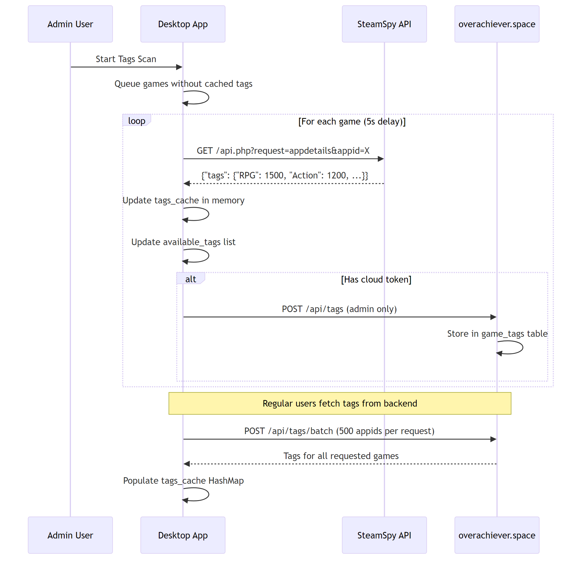

---

## Achievement Rating Flow

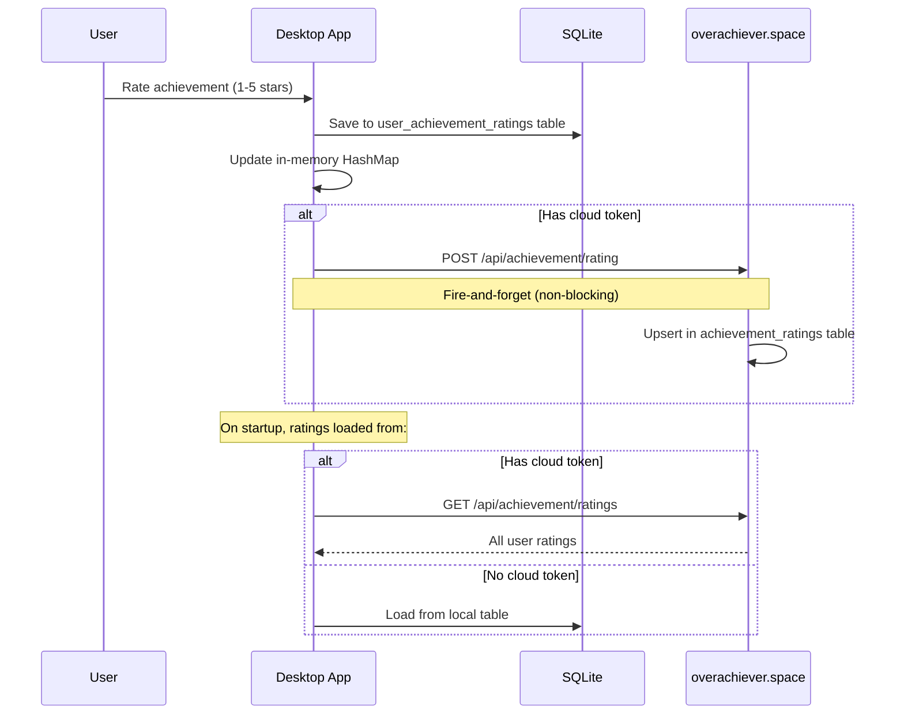
```mermaid
sequenceDiagram
    participant User
    participant App as Desktop App
    participant DB as SQLite
    participant Backend as overachiever.space

    User->>App: Rate achievement (1-5 stars)
    App->>DB: Save to user_achievement_ratings table
    App->>App: Update in-memory HashMap

    alt Has cloud token
        App->>Backend: POST /api/achievement/rating
        Note over App,Backend: Fire-and-forget (non-blocking)
        Backend->>Backend: Upsert in achievement_ratings table
    end

    Note over App: On startup, ratings loaded from:
    alt Has cloud token
        App->>Backend: GET /api/achievement/ratings
        Backend-->>App: All user ratings
    else No cloud token
        App->>DB: Load from local table
    end
```

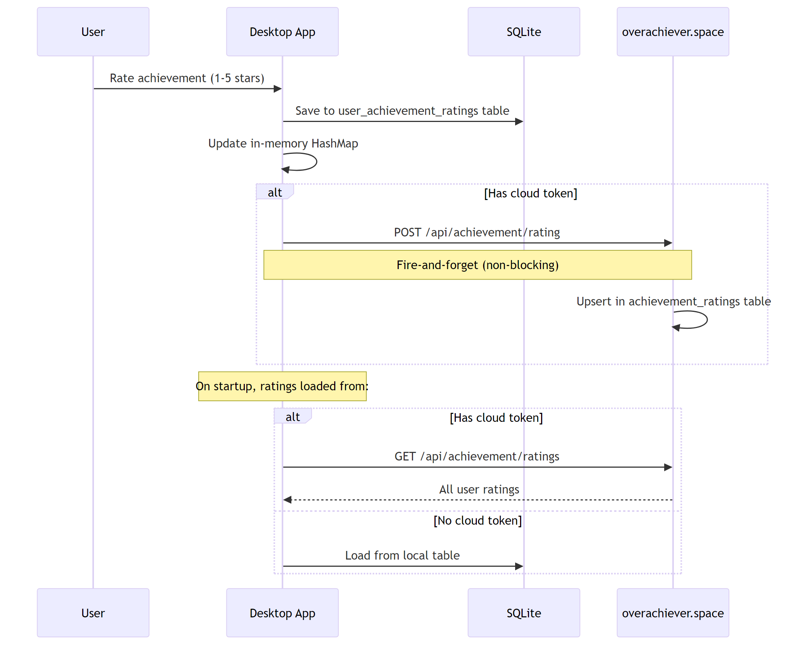

---

## In-Memory Caching

The app maintains several in-memory caches for performance. These are populated from the database and API calls, and serve the UI without additional I/O.

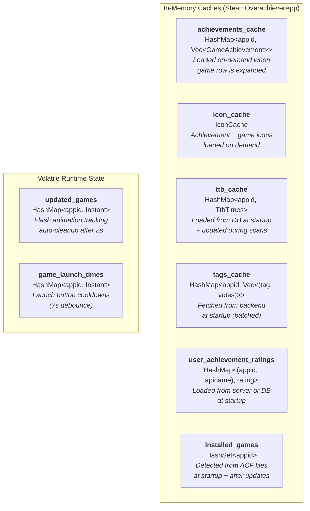
```mermaid
graph TD
    subgraph Memory["In-Memory Caches (SteamOverachieverApp)"]
        AC["<b>achievements_cache</b><br/>HashMap&lt;appid, Vec&lt;GameAchievement&gt;&gt;<br/><i>Loaded on-demand when<br/>game row is expanded</i>"]
        IC["<b>icon_cache</b><br/>IconCache<br/><i>Achievement + game icons<br/>loaded on demand</i>"]
        TC["<b>ttb_cache</b><br/>HashMap&lt;appid, TtbTimes&gt;<br/><i>Loaded from DB at startup<br/>+ updated during scans</i>"]
        TAGS["<b>tags_cache</b><br/>HashMap&lt;appid, Vec&lt;(tag, votes)&gt;&gt;<br/><i>Fetched from backend<br/>at startup (batched)</i>"]
        RATINGS["<b>user_achievement_ratings</b><br/>HashMap&lt;(appid, apiname), rating&gt;<br/><i>Loaded from server or DB<br/>at startup</i>"]
        INSTALLED["<b>installed_games</b><br/>HashSet&lt;appid&gt;<br/><i>Detected from ACF files<br/>at startup + after updates</i>"]
    end

    subgraph Volatile["Volatile Runtime State"]
        FLASH["<b>updated_games</b><br/>HashMap&lt;appid, Instant&gt;<br/><i>Flash animation tracking<br/>auto-cleanup after 2s</i>"]
        LAUNCH["<b>game_launch_times</b><br/>HashMap&lt;appid, Instant&gt;<br/><i>Launch button cooldowns<br/>(7s debounce)</i>"]
    end
```

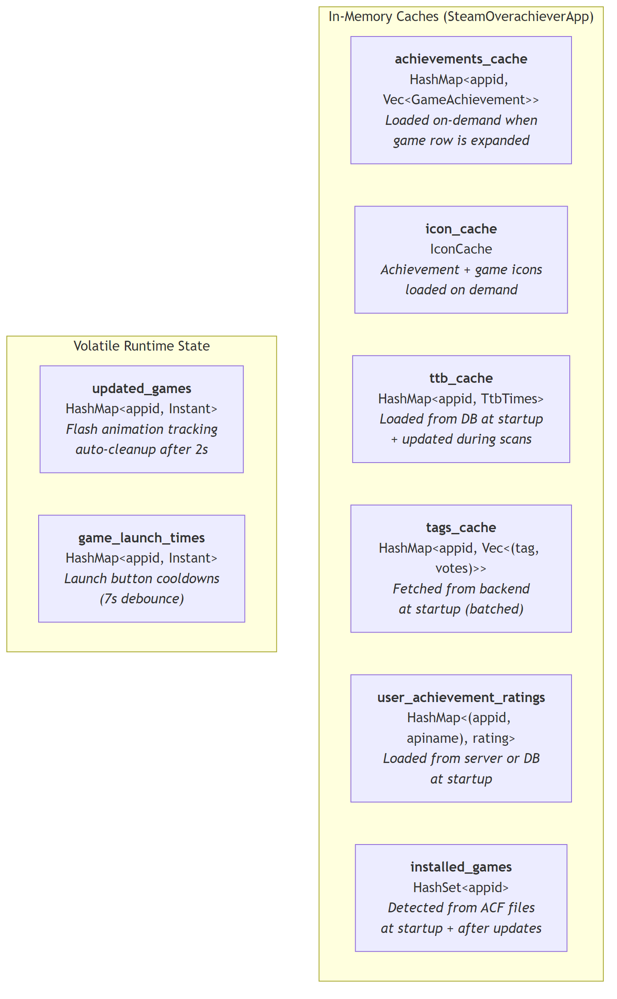

### Cache Lifecycle

| Cache | Populated | Updated | Evicted |
|-------|-----------|---------|---------|
| `achievements_cache` | When user expands a game row | On single-game refresh | On app restart |
| `icon_cache` | On demand (first render) | Never (icons don't change) | On app restart |
| `ttb_cache` | Startup (from DB) | During TTB scans, cloud download | On app restart |
| `tags_cache` | Startup (from backend) | During tags scans | On app restart |
| `user_achievement_ratings` | Startup (from server/DB) | When user rates | On app restart |
| `installed_games` | Startup (ACF files) | After each update | On app restart |

---

## Background Operations & Progress

All long-running operations run in background threads and communicate with the UI via `mpsc` channels.

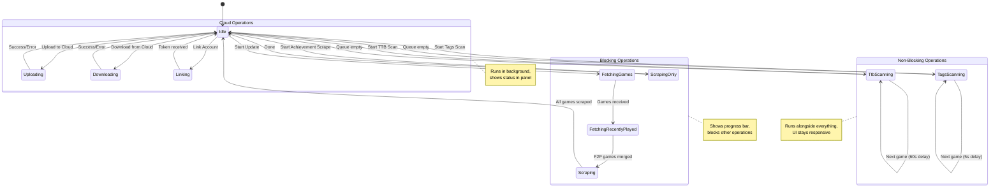
```mermaid
stateDiagram-v2
    [*] --> Idle

    state "Blocking Operations" as blocking {
        Idle --> FetchingGames: Start Update
        FetchingGames --> FetchingRecentlyPlayed: Games received
        FetchingRecentlyPlayed --> Scraping: F2P games merged
        Scraping --> Idle: All games scraped

        Idle --> ScrapingOnly: Start Achievement Scrape
        ScrapingOnly --> Idle: Done
    }

    state "Non-Blocking Operations" as nonblocking {
        Idle --> TtbScanning: Start TTB Scan
        TtbScanning --> TtbScanning: Next game (60s delay)
        TtbScanning --> Idle: Queue empty

        Idle --> TagsScanning: Start Tags Scan
        TagsScanning --> TagsScanning: Next game (5s delay)
        TagsScanning --> Idle: Queue empty
    }

    state "Cloud Operations" as cloud {
        Idle --> Uploading: Upload to Cloud
        Uploading --> Idle: Success/Error

        Idle --> Downloading: Download from Cloud
        Downloading --> Idle: Success/Error

        Idle --> Linking: Link Account
        Linking --> Idle: Token received
    }

    note right of blocking: Shows progress bar,<br/>blocks other operations
    note right of nonblocking: Runs alongside everything,<br/>UI stays responsive
    note right of cloud: Runs in background,<br/>shows status in panel
```

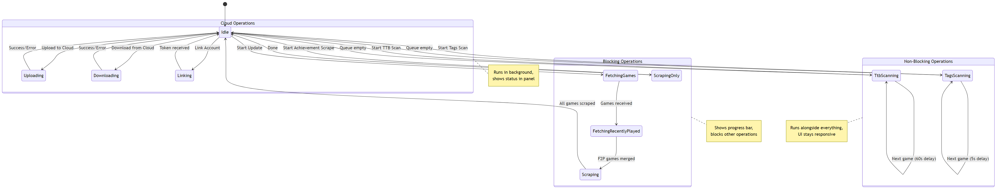

### Operation Characteristics

| Operation | Blocking? | Progress Tracking | Rate Limited | Thread |
|-----------|-----------|-------------------|--------------|--------|
| Steam Update | Yes | Channel → per-game progress | 100ms/game | Background |
| Achievement Scrape | Yes | Channel → {current, total} | 100ms/game | Background |
| TTB Scan | No | Tick-based (checked each frame) | 60s/game | Background per-game |
| Tags Scan | No | Tick-based (checked each frame) | 5s/game | Background per-game |
| Cloud Upload | No | Byte progress via channel | None | Background |
| Cloud Download | No | Status messages | None | Background |
| Single Game Refresh | No | Channel → completion | None | Background |
| CJK Font Download | No | Byte progress via channel | None | Background |

---

## API Endpoint Reference

### Backend Routes (`overachiever.space`)

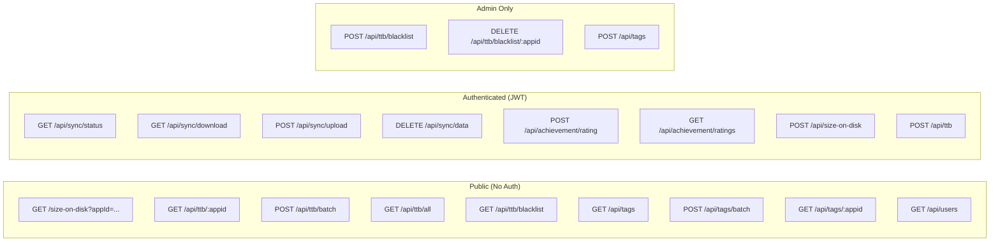
```mermaid
graph LR
    subgraph Public["Public (No Auth)"]
        P1["GET /size-on-disk?appId=..."]
        P2["GET /api/ttb/:appid"]
        P3["POST /api/ttb/batch"]
        P4["GET /api/ttb/all"]
        P5["GET /api/ttb/blacklist"]
        P6["GET /api/tags"]
        P7["POST /api/tags/batch"]
        P8["GET /api/tags/:appid"]
        P9["GET /api/users"]
    end

    subgraph Auth["Authenticated (JWT)"]
        A1["GET /api/sync/status"]
        A2["GET /api/sync/download"]
        A3["POST /api/sync/upload"]
        A4["DELETE /api/sync/data"]
        A5["POST /api/achievement/rating"]
        A6["GET /api/achievement/ratings"]
        A7["POST /api/size-on-disk"]
        A8["POST /api/ttb"]
    end

    subgraph Admin["Admin Only"]
        D1["POST /api/ttb/blacklist"]
        D2["DELETE /api/ttb/blacklist/:appid"]
        D3["POST /api/tags"]
    end
```

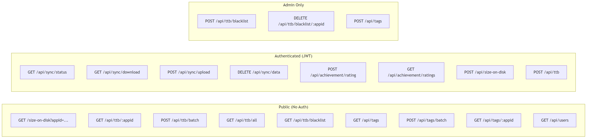

### Authentication Endpoints

| Method | Path | Purpose |
|--------|------|---------|
| GET | `/auth/steam` | Initiate Steam OpenID login |
| GET | `/auth/steam/callback` | Handle OpenID callback, issue JWT |

---

## Crate Structure

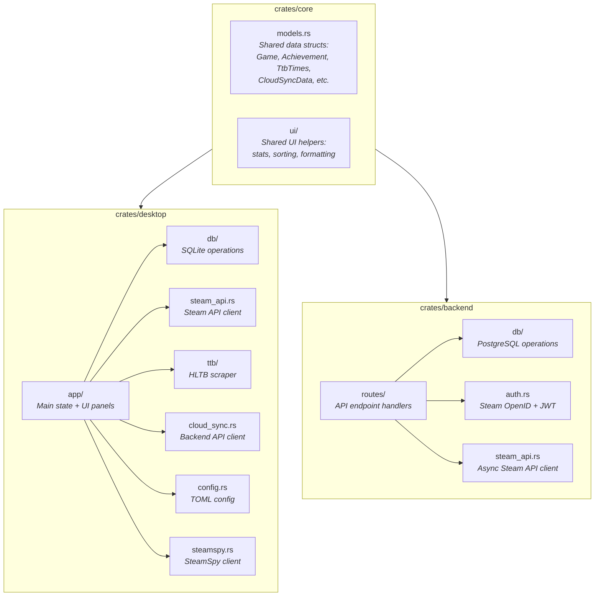
```mermaid
graph TB
    subgraph core["crates/core"]
        MODELS["models.rs<br/><i>Shared data structs:<br/>Game, Achievement, TtbTimes,<br/>CloudSyncData, etc.</i>"]
        UI_HELPERS["ui/<br/><i>Shared UI helpers:<br/>stats, sorting, formatting</i>"]
    end

    subgraph desktop["crates/desktop"]
        APP["app/<br/><i>Main state + UI panels</i>"]
        DB["db/<br/><i>SQLite operations</i>"]
        STEAM["steam_api.rs<br/><i>Steam API client</i>"]
        TTB["ttb/<br/><i>HLTB scraper</i>"]
        CLOUD["cloud_sync.rs<br/><i>Backend API client</i>"]
        CFG["config.rs<br/><i>TOML config</i>"]
        SSPY["steamspy.rs<br/><i>SteamSpy client</i>"]
    end

    subgraph backend["crates/backend"]
        ROUTES["routes/<br/><i>API endpoint handlers</i>"]
        BDB["db/<br/><i>PostgreSQL operations</i>"]
        AUTH["auth.rs<br/><i>Steam OpenID + JWT</i>"]
        BSTEAM["steam_api.rs<br/><i>Async Steam API client</i>"]
    end

    core --> desktop
    core --> backend

    APP --> DB
    APP --> STEAM
    APP --> TTB
    APP --> CLOUD
    APP --> CFG
    APP --> SSPY

    ROUTES --> BDB
    ROUTES --> AUTH
    ROUTES --> BSTEAM
```

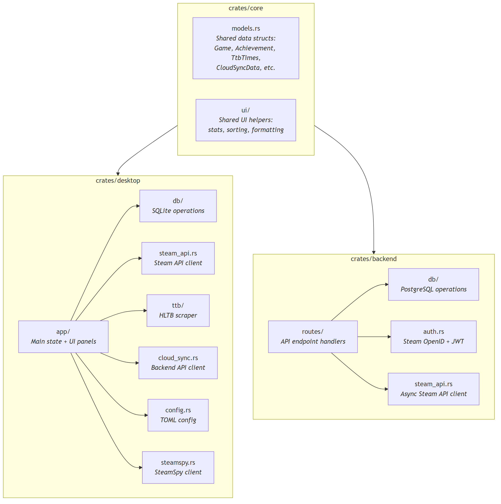
